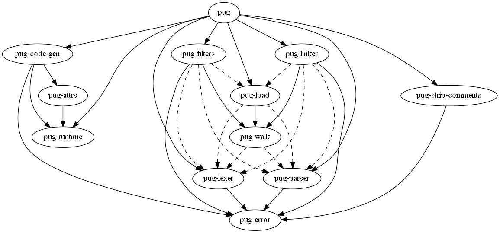

# lerna-dependency-graph

Outputs dependencies in a Lerna monorepo using Graphviz.

  
_Graph of [Pug (template engine)](https://github.com/pugjs/pug)._

## Usage

    npm i -D lerna-dependency-graph

Add a script entry in your package.json:

```json
  "scripts": {
    "graph": "lerna-dependency-graph"
  },
```

Execute:

    npm run graph [-- options]

## Options

The most important ones are:

- `-f <format>` / `--outputFormat <format>`  
  Outputs the given format.  
  If not given, outputs plain DOT.  
  [List of available output formats](https://www.graphviz.org/doc/info/output.html)
- `-o <path>` / `--outputPath <path>`  
  File to write into.  
  If not given, outputs on stdout.

See all options with `-h`.
